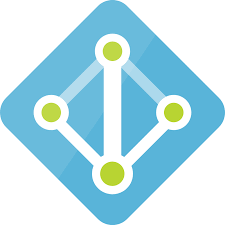

<!-- _class: blue -->
# HoloLens 開発者向け!!
## Azureでサーバーサイドを簡単に開発しよう！

C#er
大田　一希

---

# 自己紹介
- 名前: Kazuki Ota (大田　一希)
- 仕事: 某会議系企業でエンジニアとして働いています
- 好き: C#, TypeScript, Azure, UWP, WPF, Xamarin, Vue.js, Blazor
- 苦手: 型のない言語
### プライベート
ゲームを最近やりすぎてる。

---

# 今日のゴール

### Azure でサーバーサイド開発をなるべく簡単にする方法を知ってもらう

---
<!-- _class: blue -->
# 使うべきサービス

---

#  Azure App Service

アプリを動かすためのサービス

- クラウドのカテゴリーとしては PaaS (Platform as a Service) / FaaS (Function as a Service)
- Web Apps (PaaS) / Function Apps (PaaS, FaaS)
- アプリを書いてデプロイしたら動く

### こんな人にお勧め
- サーバーの管理はなるべくしたくないアプリ開発者

---

#  Cosmos DB

Azure で一番強い NoSQL DB

- 色々なタイプの API を提供する NoSQL DB
  - SQL API
  - Cassandra API
  - Mongo DB API
  - Gremlin API
  - Table API
  - etcd API

---

#  Cosmos DB

こんな人にお勧め

- とりあえず DB 設計をかっちりしない状態で柔軟にデータを突っ込みたい

---

#  SQL Database

リレーショナルデータベースが欲しかったらこれ

- SQL Server と、ほぼ同じ感じ

### こんな人にお勧め
- RDBMS が馴染む

---

#  Azure AD

認証機能使いたかったらこれ

- Azure AD
- Azure AD B2C (多分こっちのほうが皆にとって使いやすい)

### こんな人にお勧め
- 組織用アカウントで認証するようなアプリを作りたい（Azure AD)
- MS アカウント、Google アカウント、Twitter, Facebook 認証などを使いたい (Azure AD B2C)

---

#  Azure SignalR Service

Web Socket を使ってサーバーからクライアント方向に命令が送れる

- Web Apps / Function Apps(Azure Functions) と組み合わせて使う

### こんな人にお勧め
- サーバーからクライアントに変更通知を送るようなアプリを作る人

---

# 今日ピックアップするもの

- Azure Functions
- SignalR Service
- Cosmos DB
- Azure AD B2C

---
<!-- _class: blue -->
# Azure Functions

---

#  Azure Functions

Azure 上で一番少ないコードで Web API を公開できるサービス

---
<!-- _class: simple -->

# デモ

---

# 重要な機能

### トリガー

関数が呼び出されるキッカケ

- HttpTrigger, QueueTrigger, BlobTrigger, TimerTrigger, etc...

### 入力・出力

引数を外部リソースに紐づける機能
- Blob, Queue, Cosmos DB, SignalR Service, SendGrid, etc...

---

# 使いどころ

- Web API
- SignalR を使ったクライアント側の処理の呼び出し
- 定期的に繰り返される処理
- etc...

---

# 制限事項とプラン

- 実行時間に制限あり（デフォルト 1 回の関数実行あたり 5 分)

|プラン|解説|規定値|最大値|
|:---|:---|:---|:---|
|コンサンプション|使ったぶんだけ課金。サーバーレス。|5 分|10 分|
|App Service|選択したプランに応じて月額課金。 常時起動が可能。|30 分|無制限|

この他に HttpTrigger は 2.5 分でタイムアウトになるという制限もある。
（処理自体は裏で実行される）

---

# 応用的なもの

### Durable Functions

長時間にわたる大規模なステートフルなワークフローをサーバーレスで開発するもの。

---

# Azure Functions まとめ

- 一番少ないコードで Web API が作れる
- 制限事項はあるので最初に確認しよう

---

<!-- _class: blue -->

# SignalR Service

---

# ASP.NET Core SignalR

Web でサーバーからクライアント方向への通信が出来るライブラリ

### サポートしているプラットフォーム
- JavaScript (Web ブラウザー)
- .NET
- Java

---

# SignalR Service

- 大規模なクライアントのケースでも安心して使える（SLA 有り）
- Azure Functions と連携して使える

---
<!-- _class: blue -->

# デモ

---

# IL2CPP でコンパイルするときの注意事項

https://blog.xin9le.net/entry/2019/05/03/231001

---

# 追加情報

- Azure 無料体験版 (22,500円 30 日)
  [Azure 無料アカウント](https://azure.microsoft.com/ja-jp/offers/ms-azr-0044p/)
- 無料で実際に Azure を使って学習できるサイト
  [Microsoft Learn](https://docs.microsoft.com/ja-jp/learn/)

---
# ご清聴ありがとうございました！
<!-- 
_class: blue
-->
