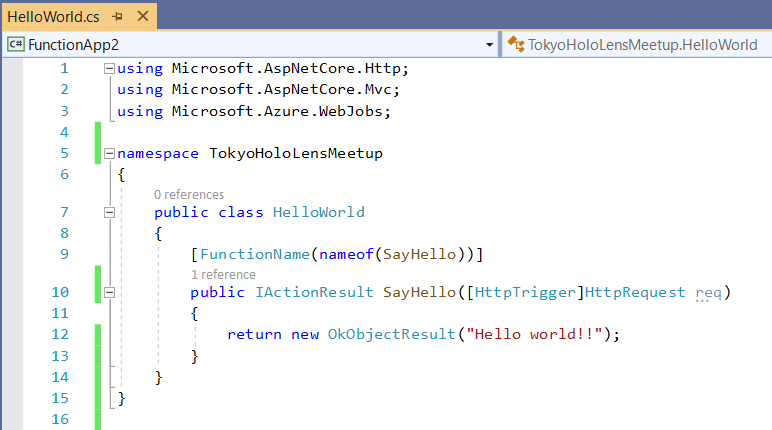
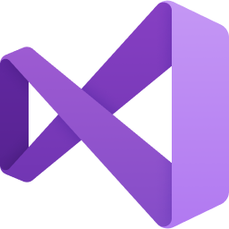
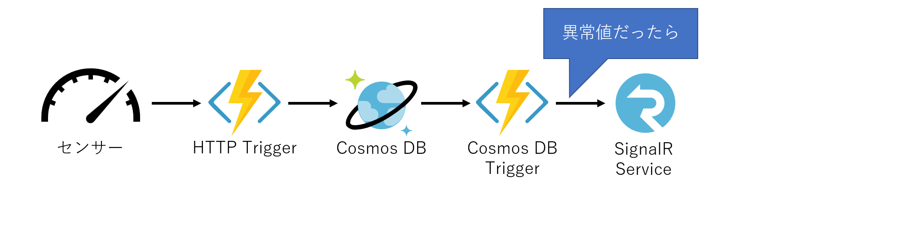
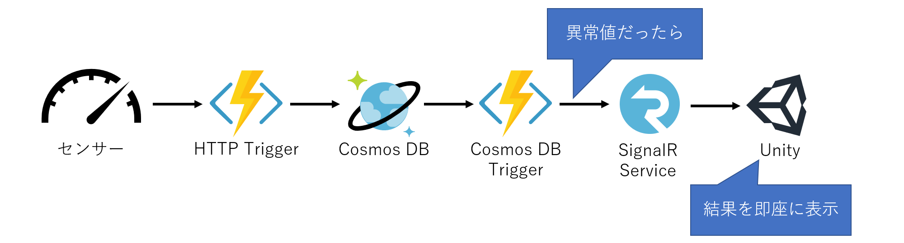

<!-- _class: blue -->
# HoloLens 開発者向け!!
## Azureでサーバーサイドを簡単に開発しよう！

C#er
大田　一希


---

# 自己紹介
- 名前: Kazuki Ota (大田　一希)
- 仕事: 日本マイクロソフトでサポート系の
  エンジニアとして働いています
- 好き: C#, TypeScript, Azure, UWP, WPF, Xamarin, Vue.js, Blazor
- 苦手: 型のない言語
### プライベート
ゲームを最近やりすぎてる。


---

# 今日のゴール

### Azure でサーバーサイド開発をなるべく簡単にする方法を知ってもらう

---
<!-- _class: blue -->
# 使うべきサービス

---
<!-- _class: simple -->


# Azure Functions

---
<!-- _class: simple -->

今回は  を推していくセッションです。

---
<!-- _class: blue -->
# Azure Functions

---
#  Azure Functions

Azure のサーバーレスのサービス
Azure 上で一番少ないコードで Web API を公開できるサービス



---
<!-- _class: blue -->

# デモ

---

# 重要な機能

### トリガー

関数が呼び出されるキッカケ

- HttpTrigger, QueueTrigger, BlobTrigger, TimerTrigger, etc...

### バインディング

引数を外部リソースに紐づける機能（入力方向と出力方向があります）
- Blob, Queue, Cosmos DB, SignalR Service, SendGrid, etc...

---

# 関数の定義方法

普通の関数を定義します
```cs
public async Task SampleFunction()
{
}

```

---
# 関数の定義方法

関数名をつけます
```cs
[FunctionName("SampleFunction")]
public async Task SampleFunction()
{
}
```

---

# 関数の定義方法

トリガーを属性で指定します

```cs
[FunctionName("SampleFunction")]
public async Task SampleFunction(
    [HttpTrigger(
        AuthrizationLevel.Function, 
        "post", "get", 
        Route = "sample")]HttpRequest req)
{
}
```

---

# 関数の定義方法

トリガーに応じた戻り値（出力）を指定して…

```cs
[FunctionName("SampleFunction")]
public async Task<IActionResult> SampleFunction(
    [HttpTrigger(
        AuthrizationLevel.Function, 
        "post", "get", 
        Route = "sample")]HttpRequest req)
{
}
```

---

# 関数の定義方法

処理を書いて完成！！

```cs
[FunctionName("SampleFunction")]
public async Task<IActionResult> SampleFunction(
    [HttpTrigger(
        AuthrizationLevel.Function, "post", "get", Route = "sample")]HttpRequest req)
{
    string name = req.Query["name"];
    if (string.IsNullOrEmpty(name))
    {
        return new BadRequestResult();
    }

    return new OkObjectResult($"Hello {name}");
}
```

---
# 実行すると…

`http://localhost:7071/api/sample` でアクセス可能に！

### ローカルで実行すると以下のように表示されます

```
Now listening on: http://0.0.0.0:7071
Application started. Press Ctrl+C to shut down.

Http Functions:

    SampleFunction: [POST,GET] http://localhost:7071/api/sample
```


---

# 開発環境

## On Windows
-   Visual Studio 2019 最強

## On Linux and macOS

-  Visual Studio Code + Azure 系拡張機能 + C# 拡張機能
- Azure Functions Core Tools

---

# ここまでのまとめ

- Azure Functions が一番少ないコードで Web API を公開できる
- トリガー・入力と出力のバインディング
- 開発は Visual Studio ファミリーで

---
<!-- _class: blue -->
# トリガーとバインディング

---

# 紹介するトリガーとバインディング
- HTTP
- Queue
- Blob
- Cosmos DB
- SignalR

完全なリストは Azure Functions のドキュメントの リファレンス → バインド から
https://docs.microsoft.com/ja-jp/azure/azure-functions/

---

# HTTP

HTTP で関数を起動するトリガー
```cs
// 認証レベル（匿名、関数、管理者）
[HttpTrigger(AuthorizationLevel.Function, 
    // 対応する HTTP メソッド
    "get", "post",
    // api/xxxx で呼び出す（デフォルトは api/関数名)
    Route = "xxxx")] HttpRequest req
```
戻り値がレスポンスに対応
- `IActionResult` を実装した型を返す
  （`OkObjectResult`, `NotFoundResult`, `BadRequestResult`, etc...)

---

# HTTP トリガー関数の Unity からの呼び方

普通に `UnityWebRequest` を使えます。

```cs
var req = UnityWebRequest.Get(uri); // Post, etc...
yield return req.SendWebRequest();
_outputText.text = req.downloadHandler.text;
```

---

# Queue

Azure Storage アカウントの Queue にメッセージが来たら実行するトリガー

```cs
[QueueTrigger("queuename")] string message
```

Queue のメッセージが JSON の場合は

```cs
[QueueTrigger("queuename")] SomeObject message
```

---

# Blob

Azure Storage アカウントの Blob への入出力とトリガー
```
トリガーは、実行までにタイムラグがあったり大規模には向かないとかあるので個人的には別で代替したい
```

Blob へのファイル入出力で使える
```cs
[Blob("images/{queueTrigger}.png", FileAccess.Read)] Stream input,
[Blob("images/{queueTrigger}-out.png", FileAccess.Write)] Stream output,
```

Stream 以外にも `ICloudBlob` などの、多機能なものも使える。

---

# Cosmos DB

Azure 最強の NoSQL データベースと繋がる

データに追加や更新があったら何かするトリガー
```cs
[CosmosDbTrigger("databaseName", "collectionName",
    ConnectionStringSetting = "ConnectionStringSettingName",
    CreateLeaseCollectionIfNotExists = true,
    LeaseCollectionPrefix = "xxx")] IReadOnlyList<Document> changes
```

---

# Cosmos DB

Cosmos DB からの入力 (ID 指定のほかに SQL での検索も可能)
```cs
[CosmosDB("databaseName", "collectionName", 
    ConnectionStringSetting = "CosmosDb", 
    Id = "{Query.id}")]SomeObject inputData
```

Cosmos DB への出力
```cs
[CosmosDB("databaseName", "collectionName", 
    ConnectionStringSetting = "CosmosDb")]
    IAsyncCollector<SomeObject> outputs
```

---

# SignalR Service

Web Socket を使ったサーバーからクライアントへのプッシュ配信

クライアントへの接続情報提供
```cs
[SignalRConnectionInfo(HubName = "hubName")]
SignalRConnectionInfo connectionInfo
```

クライアントへのメッセージの配信
```cs
 [SignalR(HubName = "hubName")]
 IAsyncCollector<SignalRMessage> messages
```

---

# 色々説明しましたが…

## Azure Functions とは
簡単に色々なものにつなげて処理を書けるプラットフォーム

---

# 例えばこんな風に使えそう

センサーがあって


---

# 例えばこんな風に使えそう

HTTP で定期的にデータを上げてて


---

# 例えばこんな風に使えそう

それを DB に保存して


---

# 例えばこんな風に使えそう

DB にデータが追加されたらセンサーデータのチェック処理をして


---

# 例えばこんな風に使えそう

値が異常だったら SignalR Service に流して



---

# 例えばこんな風に使えそう

Unity(HoloLens など) でリアルタイムに表示




---
<!-- _class: blue -->
# デモ

---

<!-- _class: blue -->
# その他参考情報

---
<!-- _class: simple -->
# いいことばかり話しましたが…
---
# 制限事項とプラン

- 実行時間に制限あり（デフォルト 1 回の関数実行あたり 5 分)

|プラン|解説|規定値|最大値|
|:---|:---|:---|:---|
|コンサンプション|使ったぶんだけ課金。サーバーレス。|5 分|10 分|
|App Service|選択したプランに応じて月額課金。<br />常時起動が可能。|30 分|無制限|

この他に HttpTrigger は 2.5 分でタイムアウトになるという制限もある。
（処理自体は裏で実行される）

---

# ベストプラクティスを把握しよう

Azure Functions のパフォーマンスと信頼性を最適化する
https://docs.microsoft.com/ja-jp/azure/azure-functions/functions-best-practices

---

# 応用的なもの

#### Dependency Injection(DI) 対応してます
.NET Azure Functions で依存関係の挿入を使用する
https://docs.microsoft.com/ja-jp/azure/azure-functions/functions-dotnet-dependency-injection

#### Durable Functions
長時間にわたる大規模なステートフルなワークフローをサーバーレスで開発するもの。
https://docs.microsoft.com/ja-jp/azure/azure-functions/durable/durable-functions-overview

---

# 認証も対応してます

- デフォルトで認証キー（要は長い文字列）による認証

- Azure AD B2C を使えば 
  Twitter, MS, Facebook, etc...(将来的には Apple ID も) に対応

---
<!-- _class: blue -->
# まとめ

---

# まとめ

- Azure Functions はいいぞ
  - コード量が少ない
  - 簡単
  - サーバーレスならではの制限もあるので気を付けてね
- 実は今日紹介したのは全てサーバーレスサービス
  - サーバーレス流行ってるのでかっこいい

---
# まとめ

- 「ハンマーを持つ人にはすべてが釘に見える」に気を付けよう

---

# 追加情報

- Azure 無料体験版 (22,500円 30 日)
  [Azure 無料アカウント](https://azure.microsoft.com/ja-jp/offers/ms-azr-0044p/)
- 無料で実際に Azure を使って学習できるサイト
  [Microsoft Learn](https://docs.microsoft.com/ja-jp/learn/)
- 個人的な好みで C# しか紹介してませんでしたが Azure Functions は
  以下の言語もサポート
  - Java, JavaScript
- SignalR Client を IL2CPP でビルドするときの注意点
  - https://blog.xin9le.net/entry/2019/05/03/231001

---
# 楽しいアプリ開発を！！
<!-- 
_class: simple
-->

---

<!-- 
class: blue
footer: © Copyright Micorsoft Corporation All rights reserved. 
-->
